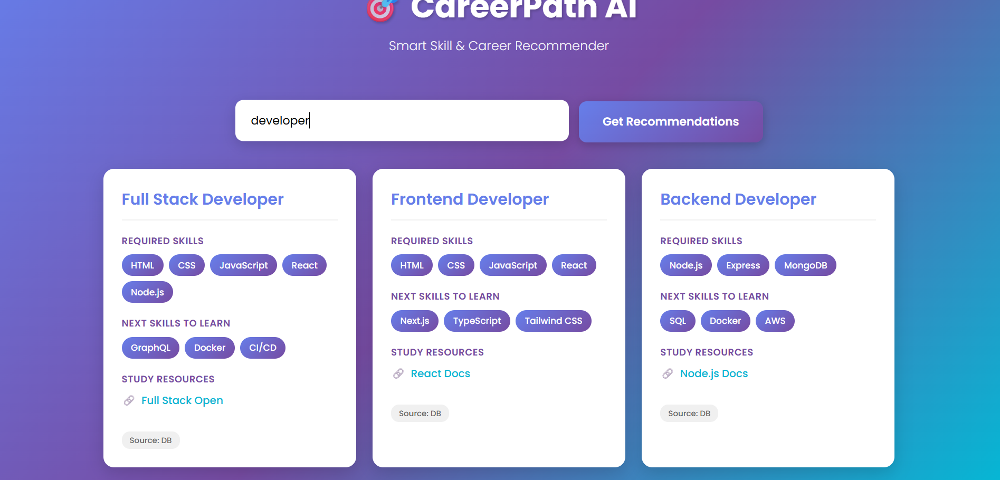

# 🧠 Career Path Finder — AI-Powered Skill & Career Recommendation App

**Turn your skills into career growth.**  
Career Path Finder helps users discover the *next best career opportunities* based on their current skills, interests, or job roles — using a **structured recommendation system** backed by **Firebase Firestore**.


---

## 🚀 Features

✅ **Skill-based recommendations** – Enter your skills or a job role and instantly get relevant career suggestions.  
✅ **Smart AI engine** – Uses intelligent logic to suggest *required* and *next-level* skills with helpful learning resources.  
✅ **Firebase Firestore integration** – Secure, scalable NoSQL database for career data.  
✅ **Node.js + Express backend** – Handles API routes, data storage, and career logic efficiently.  
✅ **Interactive frontend** – Clean UI built with HTML, CSS, and vanilla JavaScript.  
✅ **Modular architecture** – Backend and frontend are separated for clarity and scalability.  

---

## 🏗️ Tech Stack

| Layer | Technologies |
|-------|---------------|
| **Frontend** | HTML, CSS, JavaScript |
| **Backend** | Node.js, Express.js |
| **Database** | Firebase Firestore |
| **AI Utility** | OpenAI API (via helper functions) |
| **Environment Management** | dotenv |

---

## 📁 Project Structure

```
Career-Path-Finder/
│
├── backend/
│   ├── config/
│   │   ├── firebase.js
│   │   └── serviceAccountKey.json
│   ├── controllers/
│   │   └── careerController.js
│   ├── models/
│   │   └── Career.js
│   ├── routes/
│   │   └── careerRoutes.js
│   ├── utils/
│   │   └── aiHelper.js
│   ├── seed.js
│   └── server.js
│
├── frontend/
│   ├── index.html
│   ├── script.js
│   └── style.css
│
├── package.json
├── .gitignore
└── README.md
```

---

## ⚙️ Setup Instructions

### 1️⃣ Clone the Repository
```bash
git clone https://github.com/asadfarooque6/career-path-finder.git
cd career-path-finder
```

### 2️⃣ Install Dependencies
```bash
npm install
```

### 3️⃣ Configure Firebase
Create a `.env` file in `backend/` with your Firebase credentials and environment variables:
```env
PORT=5000
FIREBASE_PROJECT_ID=your_project_id
FIREBASE_PRIVATE_KEY=your_private_key
FIREBASE_CLIENT_EMAIL=your_client_email
```

### 4️⃣ Run the Server
```bash
cd backend
node server.js
```

### 5️⃣ Run Frontend
Simply open `frontend/index.html` in your browser or serve it locally with:
```bash
npx live-server frontend
```

---

## 💡 Usage

- Open the web app.  
- Type your **skills** or **desired role** in the input box.  
- Click “Get Recommendations”.  
- Instantly view:
  - Suggested **career paths**
  - **Required** and **Next-Level** skills
  - **Resources** to start learning  

---

## 📸 Screenshots
| Home Page | Recommendations |  Recommendations |
|------------|----------------|----------------|
|  |  |  

---

## 🧩 API Endpoints

**Base URL:** `http://localhost:5000/api`

| Method | Endpoint | Description |
|--------|-----------|-------------|
| `GET` | `/api/careers` | Fetch all career data |
| `POST` | `/api/careers` | Add a new career entry |
| `POST` | `/api/recommend` | Get AI-based career recommendations |

---

## 🧭 Future Improvements

- 🌐 Deploy on Vercel / Firebase Hosting  
- 🔒 User authentication (save personalized career plans)  
- 📈 Add “Learning Progress Tracker”  
- 🧮 Smarter AI with embeddings for better skill matching  
- 🎨 UI overhaul with React or Next.js  

---

## 👨‍💻 Author

**Asad Farooque**  
🎓 Student | 💻 Full Stack Developer | 🤖 Gen AI Learner  
🔗 [LinkedIn](https://www.linkedin.com/in/asadfarooque6) | [GitHub](https://github.com/asadfarooque6)

---

## 📜 License

This project is licensed under the **MIT License** — feel free to fork, use, and improve it.

---

## ⭐ Contribute

Contributions are always welcome!  
If you have ideas to make this app smarter, open an issue or submit a PR.
